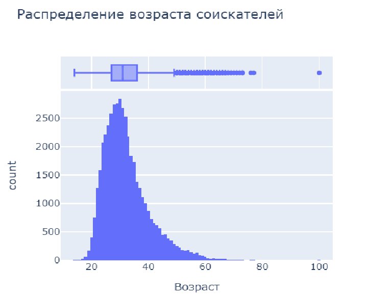
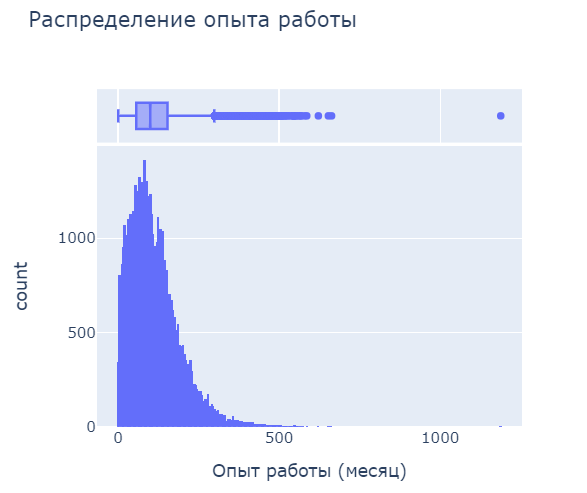
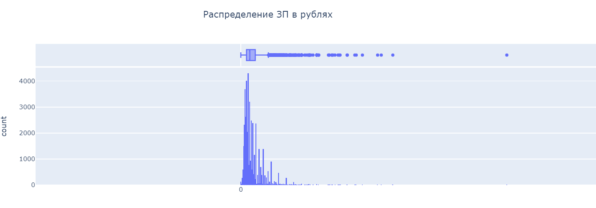
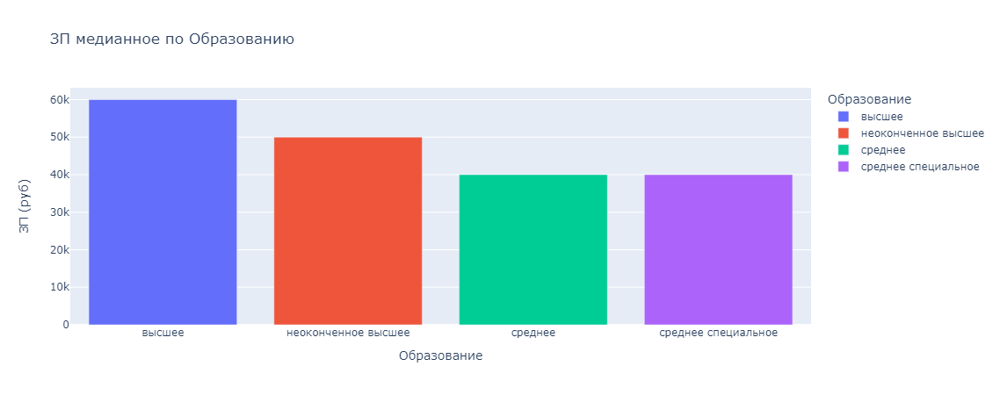
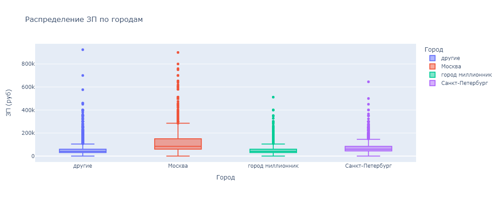
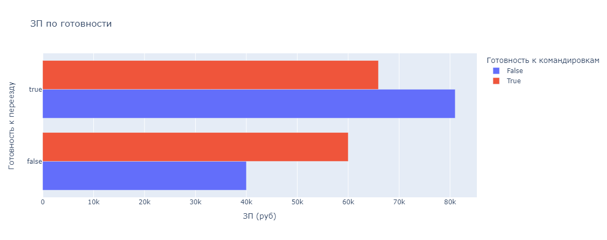
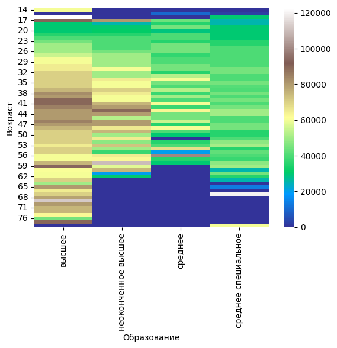
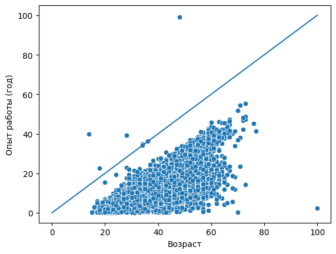
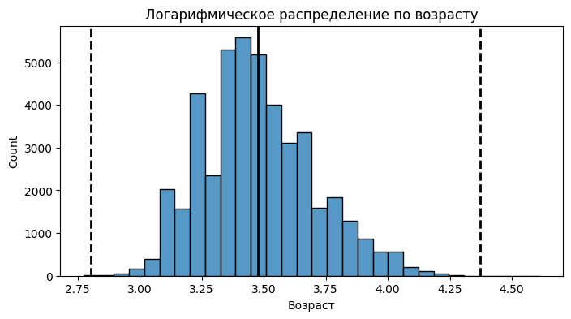

# *Проект: Анализ резюме из HeadHunter*
## <center>**Оглавление**<center>
## [1. Исследование структуры данных](https://github.com/alexmoscar/new-rep/blob/main/data/project1/Readme.md#Исследование-структуры-данных)
## [2. Преобразование данных](https://github.com/alexmoscar/new-rep/blob/main/data/project1/Readme.md#Преобразование-данных)
## [3. Исследование зависимостей в данных](https://github.com/alexmoscar/new-rep/blob/main/data/project1/Readme.md#Исследование-зависимостей-в-данных)
## [4. Очистка данных](https://github.com/alexmoscar/new-rep/blob/main/data/project1/Readme.md#Очистка-данных)
## [5. Заключение](https://github.com/alexmoscar/new-rep/blob/main/data/project1/Readme.md#Заключение)<hr>
## <center>**Основная часть**<center>
## 1. Исследование структуры данных 
### *Прочитать данные с помощью библиотеки Pandas.*
```python
database = pd.read_csv('dst-3.0_16_1_hh_database.csv', sep = ';')
print(database.shape)
print(database.info())
```
### *Вывод нескольких первых строк таблицы.*
```python
print(database.head(7))
```
### *Вывод основной информации о числе непустых значений в столбцах и их типах.*
```python
print(database.info())
```
### *Вывод основной статистической информации о столбцах.*
```python
print(database.describe())
```
[К оглавлению](https://github.com/alexmoscar/new-rep/blob/main/data/project1/Readme.md#Оглавление)<hr>

## Преобразование данных
## *В данном блоке была проведена работа по преобразованию данных, где были созданы новые, преобразованные и удалены ненужные стобцы.*
 *   **2.1.** Первое, необходимо с помощью функции-преобразования, создать новый признак "Образование", который должен иметь 4 категории: "высшее", "неоконченное высшее", "среднее специальное" и "среднее", так как изначально,в таблице, формат образования был: <Уровень образования год выпуска ВУЗ специальность...>..
 ```python
 def education_data(value):
    value = ' '.join(value.split(' ')[:3])
    if 'Высшее' in value:
        return 'высшее'
    elif 'Неоконченное высшее' in value:
        return 'неоконченное высшее'
    elif 'Среднее специальное' in value:
        return 'среднее специальное'
    elif 'Среднее образование'in value:
        return 'среднее'
database['Образование'] = database['Образование и ВУЗ'].apply(education_data)
database = database.drop('Образование и ВУЗ', axis = 1)
```
*   **2.2.** Создаем два новых признака "Пол" и "Возраст", так как был формат  <Пол , возраст , дата рождения >.
При этом важно учесть, что <ins>**Признак пола должен иметь 2 уникальных строковых значения: 'М' - мужчина, 'Ж' - женщина, и признак возраста должен быть представлен целыми числами.**<ins>
```python
def sex(value):
    if 'Мужчина' in value:
        return 'М'
    else:
        return 'Ж'
database['Пол'] = database['Пол, возраст'].apply(sex)

def ages(value):
    splitted_val = value.split(' ')
    words = ['лет','года','год']
    for index,item in enumerate(splitted_val):
        if item in words:
            return int(splitted_val[index-1])
database['Возраст'] = database['Пол, возраст'].apply(ages)
database = database.drop('Пол, возраст', axis = 1)
```
*   **2.3.** Следующим этапом преобразуем признак "Опыт работы". Его текущий формат - это: <Опыт работы: n лет m месяцев, периоды работы в различных компаниях…> <ins>Из столбца необходимо было выделить общий опыт работы соискателя в месяцах.<ins>
```python
def work_experience(value):
    if value is np.nan or value == 'Не указано':
        return None
    years = ['год','года','лет']
    months = ['месяц','месяца','месяцев']
    splitted_val = value.split(' ')[:7]
    month = 0
    year = 0
    for index,item in enumerate(splitted_val):
        if item in years:
            year = int(splitted_val[index-1])
        if item in months:
            month = int(splitted_val[index-1])
    return int(year*12+month)
database['Опыт работы (месяц)'] = database['Опыт работы'].apply(work_experience)
database = database.drop('Опыт работы', axis = 1)
```
*    **2.4** Далее был преобразован признак "Город, переезд, командировки". Информация в нем была представлена в виде: <Город , (метро) , готовность к переезду (города для переезда) , готовность к командировкам>, с лишней информацией. Преобразовывали с уловием того, что <ins>**Признак "Город" должен содержать только 4 категории: "Москва", "Санкт-Петербург" "город-миллионник" и "другие". Признак "Готовность к переезду" должен иметь два возможных варианта: True или False и признак "Готовность к командировкам" должен иметь два возможных варианта: True или False.**<ins>
```python
def city(value):
    million_cities = ['Новосибирск', 'Екатеринбург', 'Нижний Новгород', 'Казань', 'Челябинск', 'Омск',
                      'Самара', 'Ростов-на-Дону', 'Уфа', 'Красноярск', 'Пермь', 'Воронеж', 'Волгоград' ]
    splitted_city= value.split(' , ')[0]
    if (splitted_city=='Москва') or (splitted_city=='Санкт-Петербург'):
        return splitted_city
    elif splitted_city in million_cities:
        return 'город миллионник'
    else:
        return 'другие'
database['Город'] = database['Город, переезд, командировки'].apply(city)

def relocate(value):
    male_no = 'не готов'
    female_no = 'не готова'
    if (male_no in value) or (female_no in value):
        return False
    elif 'хочу' in value:
        return True
    else:
        return True
database['Готовность к переезду'] = database['Город, переезд, командировки'].apply(relocate)

def business_trip(value):
    male_no = 'не готов к командировкам'
    female_no = 'не готова к командировкам'
    if ('командировка' in value):
        if (male_no in value) or (female_no in value):
            return False
        else:
            return True
    else:
        return False
database['Готовность к командировкам'] = database['Город, переезд, командировки'].apply(business_trip)
database=database.drop('Город, переезд, командировки',axis=1)
```
*   **2.5** Далее произвели преобразование признаков "Занятость" и "График", так как они указаны таким образом, что создается много уникальных значений. Использовался метод ***One Hot Encoding:*** если категория присутствует в списке желаемых соискателем, то в столбце на месте строки рассматриваемого соискателя ставится True, иначе - False.
```python
kind_of_employ = ['полная занятость','частичная занятость','проектная работа','волонтерство','стажировка']
schedule = ['полный день','сменный график','гибкий график','удалённая работа','вахтовый метод']
for index,value in zip(kind_of_employ,schedule):
    database[index] = database['Занятость'].apply(lambda x: index in x)
    database[value] = database['График'].apply(lambda x: value in x)
database = database.drop('Занятость', axis = 1)
database = database.drop('График', axis = 1)
```
*   **2.6** Следующий этап - преобразование признака "ЗП". Проблема заключалась в том, что помимо желаемой заработной платы соискатель указывает валюту, в которой он бы хотел ее получать, а нам нужна единая валюта. Использовался признак "Обновление резюме", который помог установить дату и пересчитать курс.
```python
database['Обновление резюме'] = pd.to_datetime(database['Обновление резюме']).dt.date
currency_data = pd.read_csv('ExchangeRates.csv', sep = ',')
currency_data['date'] = pd.to_datetime(currency_data['date']).dt.date
currency_data=currency_data.drop(['per','time','vol'],axis=1)

def find_salary(value):
    salary = float(value.split(' ')[0])
    return salary
database['ЗП желаемая'] = database['ЗП'].apply(find_salary)

def currency_name(value):
    currency_dict = {'USD':'USD', 'KZT':'KZT','грн':'UAH','белруб':'BYN','EUR':'EUR','KGS':'KGS','сум':'UZS','AZN':'AZN'}
    currency = value.split(' ')[1].replace('.','')
    if currency == 'руб':
        return 'RUB'
    else:
        return currency_dict[currency]
database['курс'] = database['ЗП'].apply(currency_name)

merged = database.merge(currency_data, left_on=['курс','Обновление резюме'], right_on = ['currency','date'], how='left')
merged['close'] = merged['close'].fillna(1)
merged['proportion'] = merged['proportion'].fillna(1)
database['ЗП (руб)'] = merged['ЗП желаемая']*merged['close']/merged['proportion']

database=database.drop(['ЗП','ЗП желаемая','курс'], axis=1)
```
[К оглавлению](https://github.com/alexmoscar/new-rep/blob/main/data/project1/Readme.md#Оглавление)<hr>

## Исследование зависимостей в данных
## *В данном блоке была проведена работа по исследованию зависимостей и построении на них графиков.*
*   **3.1.** Первым был взят признак возраста и найдена мода распределения, каковы предельные значения признака, в каком примерном интервале находится возраст большинства соискателей и есть ли аномалии для признака возраста. Построены гистограмма и коробчатая диаграмма.


```python
fig = px.histogram(data_frame = database, x ='Возраст', title = 'Распределение возраста соискателей',
                   width = 500, marginal = 'box')
fig.show()
```
*   **3.2.** Далее рассматривался признак "Опыт работы (месяц)" и были получены ответы на следующие вопросы: чему равна мода распределения, каковы предельные значения признака, в каком примерном интервале находится опыт работы большинства соискателей и есть ли аномалии для признака опыта работы. А также построены гистограмма и коробчатая диаграмма.

```python
fig = px.histogram(data_frame = database, x ='Опыт работы (месяц)', title = 'Распределение опыта работы', width = 500, marginal = 'box')
fig.show()
```
*   **3.3.** Далее рассматривался признак "ЗП" и были получены ответы на следующие вопросы: каковы предельные значения признака, в каком примерном интервале находится заработная плата большинства соискателей? Есть ли аномалии для признака возраста? А также построены гистограмма и коробчатая диаграмма.

```python
fig = px.histogram(data_frame = database, x ='ЗП (руб)', title = 'Распределение ЗП в рублях', width = 8000,  marginal = 'box')
fig.show()
```
*   **3.4.** Следующим этапом была построена диаграмма, которая показывает зависимость медианной желаемой заработной платы, от уровня образования. Использовалась столбчатая диаграмма. При этом, <ins>желаемая заработная плата меньше 1 млн рублей<ins>.

```python
bar_database = database.groupby('Образование', as_index = False)['ЗП (руб)'].median()
fig = px.bar(data_frame = bar_database, x = 'Образование', y = 'ЗП (руб)', color = 'Образование', title = 'ЗП медианное по Образованию')
fig.show()
```
*   **3.5.** Следующим этапом была построена диаграмма, которая показывает распределение желаемой заработной платы ("ЗП (руб)") в зависимости от города ("Город"). Использовалась коробчатая диаграмма. При этом, <ins>желаемая заработная плата меньше 1 млн рублей<ins>.

```python
box_database = database[database['ЗП (руб)']<1e6]
fig = px.box(data_frame = box_database, x = 'Город', y = 'ЗП (руб)', color = 'Город', title = 'Распределение ЗП по городам')
fig.show()
```
*   **3.6.** Далее строили многоуровневую столбчатую диаграмму, которая показывает зависимость медианной заработной платы от признаков "Готовность к переезду" и "Готовность к командировкам". Использована стобчатая диаграмма.

```python
bars_database = database.groupby(['Готовность к командировкам','Готовность к переезду'], as_index=False)['ЗП (руб)'].median()
fig = px.bar(data_frame= bars_database, y = 'Готовность к переезду', x = 'ЗП (руб)', barmode='group', color = 'Готовность к командировкам', title = 'ЗП по готовности')
fig.show()
```
*   **3.7.** Следующим этапом была построена сводная таблица, иллюстрирующая зависимость медианной желаемой заработной платы от возраста и образования. Для анализа, построена тепловая карта.

```python
pivot_data = database.pivot_table(values = 'ЗП (руб)', index = 'Возраст', columns = 'Образование', fill_value=0,
                                  aggfunc='median')
fig = sns.heatmap(data = pivot_data, cmap='terrain')
```
*  **3.8.** Итоговой была диаграмма рассеяния, показывающая зависимость опыта работы от возраста. Также была построена дополнительная прямая, которая соответствует значениям, когда опыт работы равен возрасту человека.

```python
database['Опыт работы (год)'] = database['Опыт работы (месяц)']/12
sns.lineplot(x = [0,100], y = [0,100])
fig = sns.scatterplot(data = database, x = 'Возраст' , y = 'Опыт работы (год)')
```
[К оглавлению](https://github.com/alexmoscar/new-rep/blob/main/data/project1/Readme.md#Оглавление)<hr>

## Очистка данных
## *В данном блоке была проведена работа по очистке данных от дубликатов, пропусков и вбросов*
*   **4.1.** Удаление дубликатов.
```python
#обращаемся к списку колонок в таблице
dupl_columns = list(database.columns)
# создаем маску для отслеживания дубликатов
mask = database.duplicated(subset=dupl_columns)
# теперь, по маске ищем дубликаты и выводим их к-во
hh_duplicates = database[mask]
print(f'Число найденных дубликатов: {hh_duplicates.shape[0]}')
# через drop.duplicates, удаляем дубликаты
database = database.drop_duplicates(subset=dupl_columns)
```
*   **4.2.** Вывод информации о наличии пропусков.
```python
#находим количество пропусков
data_null = database.isnull().sum()
#выводим те столбцы, где пропусков больше 0
print(data_null[data_null>0])
```
*   **4.3.** В предыдущем пункте обнаружили,что пропуски есть в "Опыт работы (месяц)", "Последнее/нынешнее место работы", "Последняя/нынешняя должность". Что сделано: Удалены строки, где есть пропуск в столбцах с местом работы и должностью. Пропуски в столбце с опытом работы заполнены медианным значением.
```python
database = database.dropna(subset = ['Последнее/нынешнее место работы','Последняя/нынешняя должность'])
database['Опыт работы (месяц)'] = database['Опыт работы (месяц)'].fillna(database['Опыт работы (месяц)'].median())
print(round(database['Опыт работы (месяц)'].mean()))
```
*   **4.4.** Удалены выбросы, путем удаления резюме, в которых указана заработная плата либо выше 1 млн. рублей, либо ниже 1 тыс. рублей.
```python
out = database[(database['ЗП (руб)']<1e3) | (database['ЗП (руб)']>1e6)]
database = database.drop(out.index)
print(out.shape[0])
```
*   **4.5.** В процессе разведывательного анализа были обнаружили резюме, в которых опыт работы в годах, превышал возраст соискателя. Такие резюме были удалены из данных.
```python
out_age = database[database['Опыт работы (месяц)']/12> database['Возраст']]
database = database.drop(out_age.index)
print(out_age.shape[0])
```
*   **4.6.** В ходе анализа, были обнаружены потенциальные выбросы в признаке "Возраст". Это оказались резюме людей чересчур преклонного возраста для поиска работы. Было построено распределение признака в логарифмическом масштабе. Найдены и удалены выбросы с помощью метода <ins>*Z отклонений*.<ins>
```python
fig, ax = plt.subplots(1,1, figsize = (8,4))
log_age = np.log(database['Возраст']+1)
histplot = sns.histplot(log_age, bins = 30, ax=ax)
histplot.axvline(log_age.mean(), color = 'k', lw = 2)
histplot.axvline(log_age.mean()+4*log_age.std(), color = 'k', ls = '--', lw = 2)
histplot.axvline(log_age.mean()-3*log_age.std(), color = 'k', ls = '--', lw = 2)
histplot.set_title('Логарифмическое распределение по возрасту')
```

```python
def outliers_z_score_mod(database, feature, left=4, right=4, log_scale=True):
    if log_scale:
        x = np.log(database[feature]+1)
    else:
        x = database[feature]
    mu = x.mean()
    sigma = x.std()
    lower_bound = mu - left * sigma
    upper_bound = mu + right * sigma
    outliers = database[(x < lower_bound) | (x > upper_bound)]
    cleaned = database[(x >= lower_bound) & (x <= upper_bound)]
    return outliers, cleaned
outliers, cleaned = outliers_z_score_mod(database, 'Возраст',left = 3, right = 4, log_scale=True)
print(f'Число выбросов по методу z-отклонения: {outliers.shape[0]}')
```
[К оглавлению](https://github.com/alexmoscar/new-rep/blob/main/data/project1/Readme.md#Оглавление)<hr>

## Заключение
## *В результате проделанной работы был проведен большой анализ данных, которые были почищены, приведены в необходимый формат. Полученные данные проанализированы и результаты анализа, могут быть использованы для решения поставленной задачи. Все выводы и ответы на поставленные вопросы, можно найти в ноутбуке шаблоне. Ответы на вопросы не помещены в данный файл, так как они являются специфичными и не всегда могут быть необходимы для других целей, но могут "загрязнить" лишней информацией.*<hr>

### <ins>Если информация по этому проекту покажется вам интересной или полезной, то я буду очень вам благодарен, если отметите репозиторий и профиль ⭐️⭐️⭐️-дами <hr>
[К оглавлению](https://https://github.com/alexmoscar/new-rep/blob/main/data/project1/Readme.md#Оглавление)<hr>
