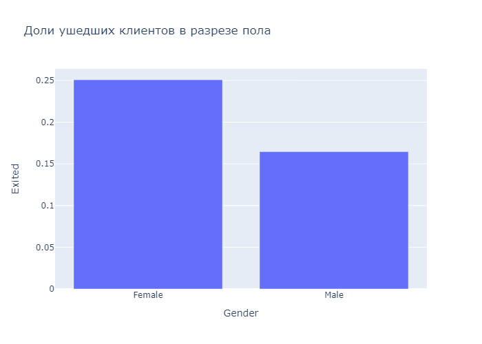

# *Визуализация данных: Задача банка*
## <center>**Оглавление**<center>
## [1. Задание 1](https://github.com/alexmoscar/new-rep/blob/main/data/visual_task/readme.md#Задание-1)
## [2. Задание 2](https://github.com/alexmoscar/new-rep/blob/main/data/visual_task/readme.md#Задание-2)
## [3. Задание 3](https://github.com/alexmoscar/new-rep/blob/main/data/visual_task/readme.md#Задание-3)
## [4. Задание 4](https://github.com/alexmoscar/new-rep/blob/main/data/visual_task/readme.md#Задание-4)
## [5. Задание 5](https://github.com/alexmoscar/new-rep/blob/main/data/visual_task/readme.md#Задание-5)
## [6. Задание 6](https://github.com/alexmoscar/new-rep/blob/main/data/visual_task/readme.md#Задание-6)
## [7. Задание 7](https://github.com/alexmoscar/new-rep/blob/main/data/visual_task/readme.md#Задание-7)
## [8. Задание 8](https://github.com/alexmoscar/new-rep/blob/main/data/visual_task/readme.md#Задание-8)
## [9. Задание 9](https://github.com/alexmoscar/new-rep/blob/main/data/visual_task/readme.md#Задание-9)
## [10. Задание 10](https://github.com/alexmoscar/new-rep/blob/main/data/visual_task/readme.md#Задание-10)<hr>
## <center>**Основная часть**<center>
## Задание 1 
### *Каково соотношение ушедших и лояльных клиентов? Покажите это на графике и дайте комментарий по соотношению.*
```python
import pandas as pd
import matplotlib.pyplot as plt
import seaborn as sns
import plotly
import plotly.express as px
churn_data = pd.read_csv('churn.csv')
left_clients = churn_data.groupby(['Exited'])['RowNumber'].count()
labels = ['Лояльные', 'Ушедшие']
plt.figure(figsize=(5,5))
plt.title('Соотношение числа лояльных и ушедших клиентов')
plt.pie(left_clients, explode = [0.1, 0], labels = labels, autopct='%.0f%%')
plt.show()
```


### Явно видно, что количество лояльных клиентов в 4 раза превышает к-во ушедших.
[К оглавлению](https://github.com/alexmoscar/new-rep/blob/main/data/visual_task/readme.md#Оглавление)<hr>

## Задание 2 
### *Постройте график, показывающий распределение баланса пользователей, у которых на счету больше 2 500 долларов. Опишите распределение и сделайте выводы.*

```python
balance_filt = churn_data[churn_data['Balance'] > 2500] #находим клиентов, у которых баланс более 2500$
fig = px.histogram(data_frame=balance_filt, x='Balance', height=500, width=700,
    title='Распределение баланса клиентов, у которых на счетах более 2500$', nbins = 30)
fig.show()
```


### Из графика видно, что самое большое количество клиентов, имеют на счетах 100-130 тыс.
[К оглавлению](https://github.com/alexmoscar/new-rep/blob/main/data/visual_task/readme.md#Оглавление)<hr>

## Задание 3 
### *Посмотрите на распределение баланса клиента в разрезе признака оттока. Как различаются суммы на накопительном счёте ушедших и лояльных клиентов? Подумайте и напишите, с чем это может быть связано, что может не устраивать ушедших клиентов в банке.*
```python
labels = ['Лояльгые','Ушедшие']
fig = px.histogram(data_frame=churn_data, x='Balance', color='Exited', height=500, width=700,
                   histfunc='count', title='Распределение баланса клиентов', nbins = 20, labels=labels)
fig.show()
```


### Исходя из графика видно, что распределение примерно одинаковое. Большая часть, как видели из предыдущего графика, находится в пределах наличия 100-150 тысяч. Также видно, что в среднем, как у лояльных так и ушедших, суммы одинаковые. Тут можно предположить, что банк не предлагает новые условия для всех клиентов по вкладам, а также не предлагает интересные условия для клиентов с суммами больше 200 000, что видно из количества клиентов с большими суммами.
[К оглавлению](https://github.com/alexmoscar/new-rep/blob/main/data/visual_task/readme.md#Оглавление)<hr>

## Задание 4
### *Посмотрите на распределение возраста в разрезе признака оттока. В какой группе больше потенциальных выбросов? На какую возрастную категорию клиентов стоит обратить внимание банку?*

```python
fig = px.box(data_frame=churn_data, x='Age', color='Exited', height=500, width=700,
    title='Распределение возраста клиентов')
fig.show()
```


### Как можно увидеть из графика, возраст лояльных клиентов (0) составляет 30-40 лет и также есть клиенты с возрастом 60+, что нормально, так как многие продолжают пользоваться услугами банка и на пенсии, есть работающие пенсионеры. Возраст ушедших клиентов 40-55 лет. Тут можно подумать о том, что бак предлагает мало идли не предлагает программы для людей такого возраста и поэтому старшие просто уходят, это видно из того, что выбросов не так много.
[К оглавлению](https://github.com/alexmoscar/new-rep/blob/main/data/visual_task/readme.md#Оглавление)<hr>

## Задание 5
### *Постройте график, который показывает взаимосвязь кредитного рейтинга клиента и его предполагаемой зарплаты. Добавьте расцветку по признаку оттока клиентов. Какова взаимосвязь между признаками? Если не видите явной взаимосвязи, укажите это.*

```python
fig = px.scatter(data_frame=churn_data, x='EstimatedSalary', y='CreditScore', height=500, width=700, color='Exited',
    title='Взаимосвязь кредитного рейтинга и предполагаемой зарплаты')
fig.show()
```


### Как видно, из данного графика сделать какие-либо выводы очень сложно, слишком много точек. Но, судяя по всему,кредитный рейтинг может быть одинаков у разных групп.
[К оглавлению](https://github.com/alexmoscar/new-rep/blob/main/data/visual_task/readme.md#Оглавление)<hr>

## Задание 6
### *Кто чаще уходит, мужчины или женщины? Постройте график, который иллюстрирует это.*

```python
gender_group = churn_data.groupby(['Gender'])['Exited'].mean() #группируем по признаку пола и лояльности и находим среднее
fig = px.bar(data_frame=gender_group, x=gender_group.index, y='Exited', height=500, width=700, title='Доли ушедших клиентов в разрезе пола')
fig.show()
```


### Явно большее количество женщин прекращают сотрудничество с банком 
[К оглавлению](https://github.com/alexmoscar/new-rep/blob/main/data/visual_task/readme.md#Оглавление)<hr>

## Задание 7
### *Как отток клиентов зависит от числа приобретённых у банка услуг? Для ответа на этот вопрос постройте многоуровневую столбчатую диаграмму.*

```python
churn_data['Loyal'] = 1 - churn_data['Exited']
out_group = churn_data.groupby(['NumOfProducts'])[['Exited', 'Loyal']].sum()
#print(grouped_by_exit)

fig = px.bar(data_frame=out_group, x=out_group.index, y=['Exited', 'Loyal'], height=500, width=700,
    title='Взаимосвязь оттока клиентов и числа приобретённых услуг')
fig.show()
```


### Судя по графику видно, что у лояльных клиентов 1-2 продукта, тогда как у ушедших есть и 3 и 4. Скорее всего, ушедшие клиенты это были клиенты, которые воспользовались интересным предложением банка и потом ушли в другой, с другим предложением.
[К оглавлению](https://github.com/alexmoscar/new-rep/blob/main/data/visual_task/readme.md#Оглавление)<hr>

## Задание 8
### *Как влияет наличие статуса активного клиента на отток клиентов? Постройте диаграмму, иллюстрирующую это. Что бы вы предложили банку, чтобы уменьшить отток клиентов среди неактивных?*

```python
active_inactive = churn_data[['IsActiveMember', 'Exited']]
active_inactive['Status'] = active_inactive['Exited'].apply(lambda x: 'Loyal' if x == 0 else 'Exited')
active_inactive.rename(columns={'Exited': 'Count'}, inplace=True)
data1 = active_inactive.groupby('IsActiveMember')['Count'].count().reset_index()
data2 = active_inactive.groupby(['IsActiveMember', 'Status'])['Count'].count().reset_index()
data2.loc[2], data2.loc[3] = data2.loc[3], data2.loc[2]
fig = plt.figure(figsize=(9,8))
fig.subplots_adjust(top=0.8)
fig.suptitle('Соотношение активных и неактивных клиентов', fontsize=18)
axes = fig.subplots(1, 2)
axes[0].pie( data1.Count, labels=['Неактивные', 'Активные'], autopct='%1.1f%%', textprops={'fontsize': 12}, startangle=0)
axes[0].set_title('Общий вклад', fontsize=14)
axes[1].set_title('Отдельно лояльные и ушедшие', fontsize=14)
axes[1].pie( data2.Count, explode=[0.1, 0, 0, 0.1], labels=['Неакт. ушедшие', 'Неакт. лояльные', 'Акт. лояльные', 'Акт. ушедшие'], autopct='%1.1f%%', textprops={'fontsize': 12}, startangle=0)
fig.show()
```


### Как видим, общее количество активных и неактивных примерно одинаковое. Среди лояльных также, примерно равный процент у активных и неактивных. Скорее всего, банк проводит мало, или вообще не поводит работу с неактивными клиентами, как доп услуги, кешбек, и т.д.
[К оглавлению](https://github.com/alexmoscar/new-rep/blob/main/data/visual_task/readme.md#Оглавление)<hr>

## Задание 9
### *В какой стране доля ушедших клиентов больше? Постройте тепловую картограмму, которая покажет это соотношение на карте мира. Предположите, с чем это может быть связано*

```python
choropleth_data = churn_data.groupby(['Geography'])['Exited'].mean()

fig = px.choropleth(data_frame=choropleth_data, locations=choropleth_data.index, locationmode = "country names",color="Exited",
    range_color=[0, 1], title='Доля ушедщих клиентов по странам', width=800, height=500, color_continuous_scale='Reds')
fig.show()
```


### Доля ущедщих клиентов, больше в Германии.
[К оглавлению](https://github.com/alexmoscar/new-rep/blob/main/data/visual_task/readme.md#Оглавление)<hr>

## Задание 10
### *Переведите числовой признак CreditScore в категориальный. Для этого воспользуйтесь функцией get_credit_score_cat(), которая приведена ниже. Примените её к столбцу CreditScore и создайте новый признак CreditScoreCat — категории кредитного рейтинга.*

```python
def get_credit_score_cat(credit_score):
    if credit_score >= 300 and credit_score < 500:
        return "Very_Poor"
    elif credit_score >= 500 and credit_score < 601:
        return "Poor"
    elif credit_score >= 601 and credit_score < 661:
        return "Fair"
    elif credit_score >= 661 and credit_score < 781:
        return "Good"
    elif credit_score >= 781 and credit_score < 851:
        return "Excellent"
    elif credit_score >= 851:
        return "Top"
    elif credit_score < 300:
        return "Deep"

churn_data['CreditScoreCat'] = churn_data['CreditScore'].apply(get_credit_score_cat)

pivot = churn_data.pivot_table(values ='Exited', index='CreditScoreCat', columns='Tenure', aggfunc='mean')

plt.figure(figsize=(10,5))
heatmap = sns.heatmap(data=pivot, cmap='coolwarm', annot=True)
heatmap.set_title('Клиенты, которые уходят чаще всего', fontsize=16)
#fig.show('warm_cl')
fig.show()
```


### Как видим, 44% клиентов с очень низким рейтингом, и менее 1 года в банке в оттоке. Также в данной категории и с низким кредитным рейтингом находятся 33% клиентов, хотя они 10 лет в банке. Также большой показатель - 28% у тех, кто менее года, но с отличной историей.
[К оглавлению](https://github.com/alexmoscar/new-rep/blob/main/data/visual_task/readme.md#Оглавление)<hr>


## Заключение
## *В результате проделанной работы был проведен анализ данных с использованием возможносетй визуализации*<hr>
[К оглавлению](https://github.com/alexmoscar/new-rep/blob/main/data/visual_task/readme.md#Оглавление)<hr>
